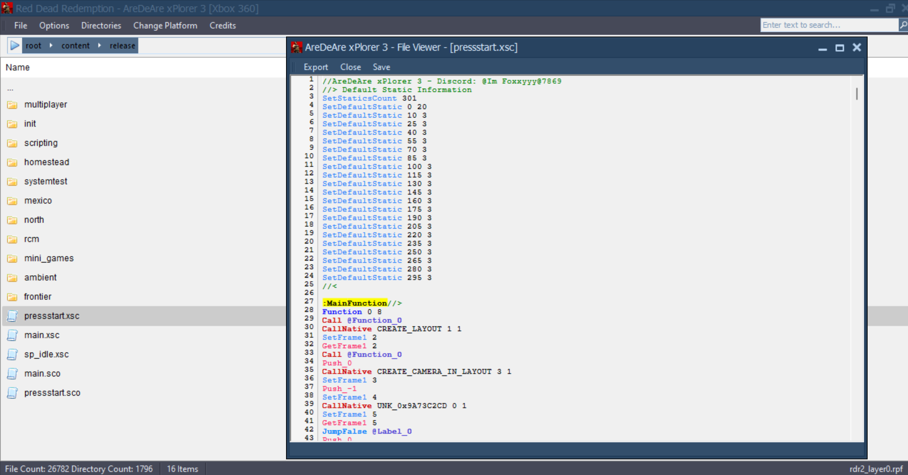
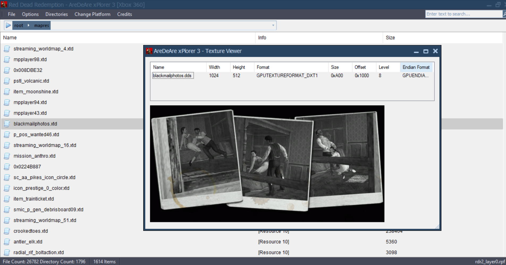

# AreDeAre-xPlorer-2
AreDeAre xPlorer is a RPF editor and archive manager for both Xbox 360 &amp; PS3 versions of Red Dead Redemption.
Tool was created by XBLToothPick in C# using the DevExpress libraries and a bit of code from twisted's RPF Tool.
The source has never been released so I decompiled it with JetBrains dotPeek.

# Updated Version
Made a new version of the tool (AreDeAre 3) with better UI, some bugs/crashs fixed, new features like searchbar or hash generator, textures viewer (.xtd/.ctd), stringtable files editor (.xst/.cst) and low-level scripts decompiler.
I might update the source in the future and maybe implement my new high-level scripts decompiler. I'm also still working on support for "movies" files aka flash aka (.xsf/.csf) and also model viewer..

What the new version could look like :

